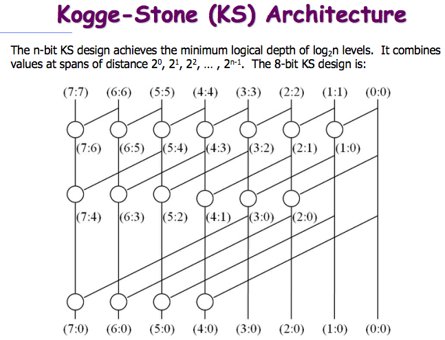

# Kogge-Stone加法器设计验证
张朕银20212020089 薛玥20212020163

## 设计原理



根据上图的拓扑关系，对点操作进行有序映射，从而节省组合逻辑运算时间，以及逻辑资源消耗。

点操作：
$$(P_{i:m},G_{i:m})\circ(P_{m-1:j},G_{m-1:j})=(P_{i:m}\cdot P_{m-1:j},G_{i:m}+P_{i:m}G_{m-1:j})\\=(P_{i:0},G_{i:0})$$

---

## 设计细节

定义点操作模块。
```
module dot(Pi1,Gi1,Pi0,Gi0,Po,Go);
//P"i:j" = P"i:m" & P"m-1:j"
//G"i:j" = G"i:m" | P"i:m" & G"m-i:j"
//Pi0: P"m-1:j"
//Gi0: G"m-1:j"
//Pi1: P"i:m"
//Gi1: G"i:m"
//Po:  P"i:j"
//Go:  G"i:j"
input  Pi0,Gi0,Pi1,Gi1;
output Po,Go;

assign Po = Pi1 & Pi0;
assign Go = Gi1 | (Pi1 & Gi0);
endmodule
```

定义一个名为KS_Adder的模块，为顶层模块，并定义其端口和位宽：
```
module KS_Adder(A,B,Ci,Co,S);
input  [15:0]A;
input  [15:0]B;
input  Ci;
output Co;
output [15:0]S;
```

然后定义内部线路C，用来表示每一位的进位。其中$C_0$表示$C_i$，$C_{16}$表示$C_o$。
```
wire   [16:0]C;
assign C[0]=Ci;
assign Co=C[16];
```

然后根据KS模型，定义所有$P_{a:b},G_{a:b}$信号（$a,b可以不等也可以相等$）。
```
wire P_0_0,G_0_0;
wire P_1_1,G_1_1;
wire P_2_2,G_2_2;
......
wire P_15_12,G_15_12;
wire P_15_8,G_15_8;
wire P_15_0,G_15_0;
```

然后给所有$P_{a:a},G_{a:a}$信号加上驱动信号。
```
assign P_0_0 = A[0] ^ B[0];
assign P_1_1 = A[1] ^ B[1];
assign P_2_2 = A[2] ^ B[2];
......
assign P_15_15 = A[15] ^ B[15];

assign G_0_0 = A[0] & B[0];
assign G_1_1 = A[1] & B[1];
assign G_2_2 = A[2] & B[2];
......
assign G_15_15 = A[15] & B[15];
```

然后给所有$P_{a:b},G_{a:b}$信号添加点操作。
```
dot dot_1_0(.Pi1(P_1_1),.Gi1(G_1_1),.Pi0(P_0_0),.Gi0(G_0_0),.Po(P_1_0),.Go(G_1_0));
dot dot_2_1(.Pi1(P_2_2),.Gi1(G_2_2),.Pi0(P_1_1),.Gi0(G_1_1),.Po(P_2_1),.Go(G_2_1));
dot dot_2_0(.Pi1(P_2_1),.Gi1(G_2_1),.Pi0(P_0_0),.Gi0(G_0_0),.Po(P_2_0),.Go(G_2_0));
......
dot dot_15_0(.Pi1(P_15_8),.Gi1(G_15_8),.Pi0(P_7_0),.Gi0(G_7_0),.Po(P_15_0),.Go(G_15_0));
```

再给$C_{0～16},S_{0～15}$添加驱动信号。
```
assign C[1] = G_0_0 | (P_0_0 & C[0]);
assign C[2] = G_1_0 | (P_1_0 & C[0]);
......
assign C[16] = G_15_0 | (P_15_0 & C[0]);

assign S[0] = P_0_0 ^ C[0];
assign S[1] = P_1_1 ^ C[1];
......
assign S[15] = P_15_15 ^ C[15];
```

最后语法收尾
```
endmodule
```

---

## 验证

由于16位加法器的全覆盖验证需要进行$2^{16}\cdot 2^{16}\cdot 2=8589934592$次验证，而这样庞大的验证量会消耗过多时间。因此最终采用的testbench方案中，采用了随机测试的方法，最终通过验证。验证覆盖率为$\cfrac{1}{2048}$。

---

## 总结

进行了KS_Adder的设计和验证，进一步加深了对SystemVerilog和组合逻辑硬件设计验证的认识。