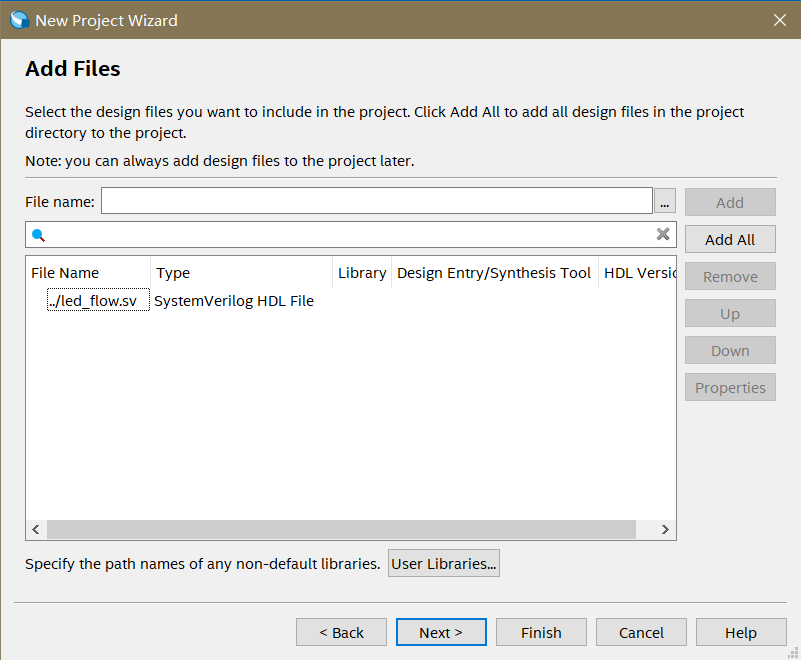

本实验在DE1-SoC (revG)上完成。

本文档为傻瓜教程，意在完整地记录实现流程。

主要设计代码为led_flow.sv
管脚约束信息如下：

------

具体流程

1，创建项目（Quartus的基本使用）

1.1打开Quartus。 

1.2打开New Project Wizard。 

1.3Next，并设置路径、项目名称。 

1.4Next，显示文件夹不存在是否创建。 

1.5选择是。 

1.6默认使用Empty Project，Next。 

1.7按"..."选择设计文件。 

1.8点击“打开”以添加。 

1.9Next，选中相应的芯片型号。 DE1-SoC使用的是5CSEMA5F31C6N，除去最后一个字符N（我也不知道为什么要除去），即5CSEMA5F31C6。如需要在其它板卡上运行请自行寻找芯片型号。 

1.10Next。 

1.11Next。 这是最终结果，检查是否正确。如果不正确，则回退到前面的步骤进行修改。 

1.12Finish。 至此，项目创建完成。

2，让Quartus分析代码。

双击左侧Tasks格中Compile Design下的Analysis&Synthesis。分析开始。使用Ctrl+L或者点击图标则是"Start Compilation"，会执行Compile Design下的所有步骤。目前这一步没有必要。这一步的目的是让Quartus知道顶层代码中有哪些端口。 

3，规定引脚信息。

3.1打开Assignment（工具栏） 

3.2 打开Assignment-Pin Planner，看到顶层设计（本工程中是led_flow）中的所有管脚。如果事先没有上一步的Analysis&Synthesis，那么这里将会是空的，看不到clk、led_o[9]等输入输出端口。 

3.3查阅官方文档，找到"DE1-SoC_v.5.1.3_HWrevF.revG_SystemCD\Schematic\DE1-SoC.pdf"，打开之。 

3.4Ctrl+F寻找内容"clock"（其他情况也可尝试"clk"等）（如果没有文字版schematic就只能肉眼寻找了），找到26项，其中最感兴趣的是第六页的内容。此处有四个clock，都含有"_50"后缀，意味着它们的频率都是50MHz。任选一个（例如AF14）。 

3.5切换到Pin Planner界面，双击clk的Location格， 

3.6键入"af14"（会自动补全为PIN_af14） 

3.7回车，发现Location中的值变成了大写，并且I/O Bank和VREF Group已自动补全。 

3.8按照3.4~3.7的步骤寻找“LED”，得到感兴趣的内容： 

去往19页，